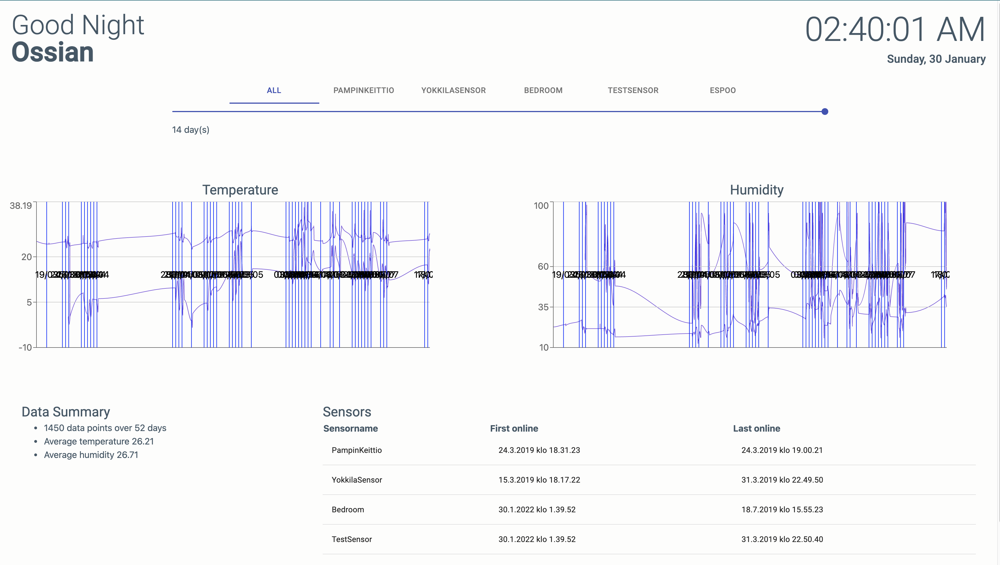

# WeatherStation

Personal project from spring 2019, that I used as final project for course DTEK1019 Embedded Microprocessor Systems at University of Turku.

Project consists of

- React frontend
- Express backend that stores data to MongoDB
- Lolin D1 Mini Lite board (with ESP8266 chip) that receives measurements from BME280 sensor and posts those to the backend

[Front and backend were deployed to Heroku](https://sulpro-weather-station.herokuapp.com/) and sensor was ran at my apartment.

> **Note:** This was among my first React projects so the structure and writing style aren't all that great 😅

